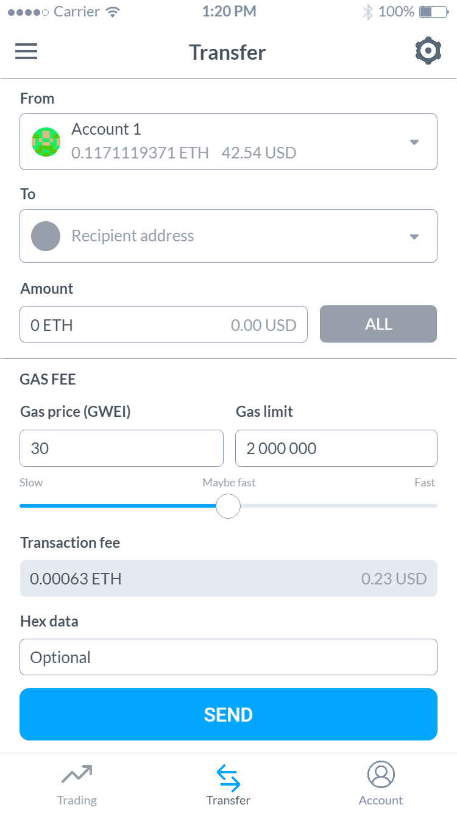
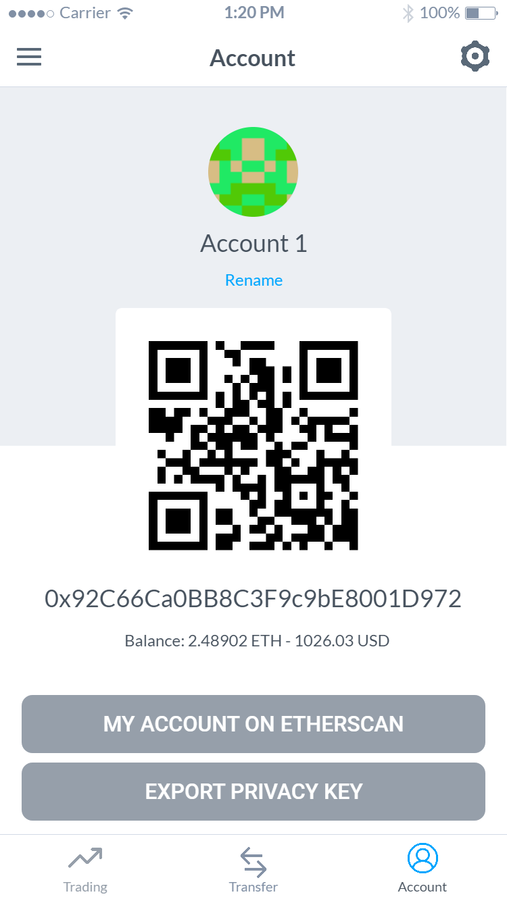

# Monowallet 

This is the best crypto wallet out there!) It's cross platform, has integrated trading. It's built using 
  - Nethereum for ETH and .NET wrappers for other blockchains (EOS, Tezos, Bitcoin maybe:), 
  - Xamarin.Forms and targetting all main mobile platforms Android, iOS, Windows and Dektop platforms(windows 10, UWP, XboX), IoT with the Raspberry PI.

Supports multisig! But!.. delegation of funds is optional (just for extra features), to avoid disasters like with Parity multisig:(

Can be used for escrow services.And P2P helps avoiding domain hijacking.

Oh btw - it's quantum-resistant using SIDH implementation ;).

Features

- Multisignature (with optional delegating funds to smart contract) and/or 2FA
- Trade without leaving your wallet
- Spend limit
- Account recovery
- Human-readable aliases
- P2P
- Quantum-resistant encryption
- Multiple platforms support desktop/mobile
- Transfer your funds to backup account in case of no activity for defined time (via optional smart contract)

Work in progress.

## Screenshots from Prototype

  

Prototype on Marvellapp : https://marvelapp.com/5ei44jb

### Done

* Generic UI design

### Todo
* Whitepaper
* Multi signature support
* Ether Transfer example
* Load account from KeyStorage, Private key and HDWallet
* ViewModels to use ReactiveUI, Validation 
* Akavache
* Secured storage integration sample
* Connect to Etherscan
* Improve UI / UX
* Mac, Linux, WPF, TV, Watch samples
* Continue testing all the platforms 
* Possibly template for other blockchains via .NET wrappers

### Installable prototypes

* iOS prototype https://marvelapp.com/build/2f4i1iadop71dr1
* Android prototype https://marvelapp.com/build/l16pcroladrbgh0
