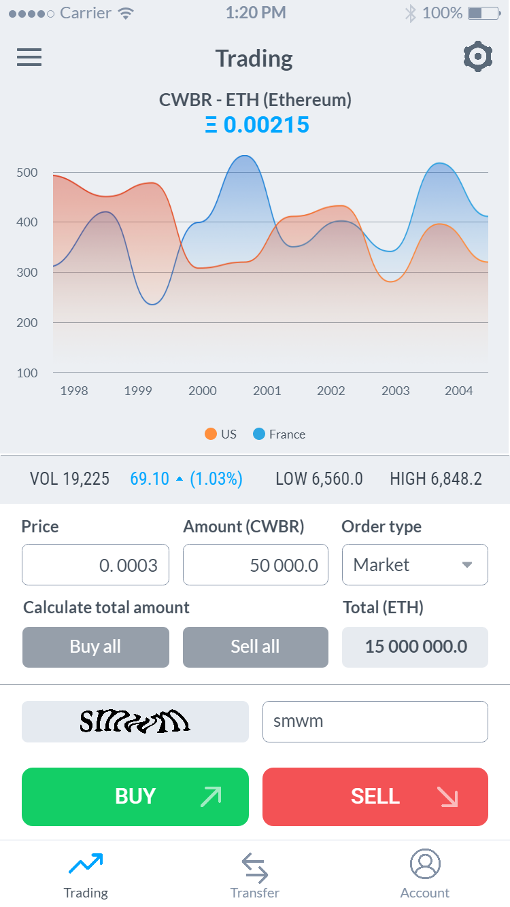

# Nethereum.UI.Wallet.Sample

This is a cross platform wallet app with integrated trading functionality for Project Crowbar using Nethereum, Xamarin.Forms and targetting all main mobile platforms Android, iOS, Windows, Dektop (windows 10 uwp), IoT with the Raspberry PI and Xbox. 

Work in progress.

## Screenshots from Morden

Prototype on Marvellapp : https://marvelapp.com/5ei44jb

### Done

* Generic UI design

### Todo
* Ether Transfer example
* Load account from KeyStorage, Private key and HDWallet
* ViewModels to use ReactiveUI, Validation 
* Akavache
* Secured storage integration sample
* Connect to BlockchainStorage / Etherscan
* Multi signature support
* Improve UI / UX
* Mac, Linux, WPF, TV, Watch samples
* Continue testing all the platforms 
* Possibly produce as template for other blockchains via .NET wrappers

### Installable prototypes

* iOS prototype https://marvelapp.com/build/2f4i1iadop71dr1
* Android prototype https://marvelapp.com/build/l16pcroladrbgh0
